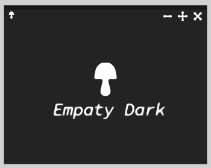

# empaty-dark-kde
---------------------

<i>Empaty Dark</i>

# Description
Empaty Dark is a minimalist and stylish theme for the KDE desktop environment, bringing a modern and refined look to your workspace. This theme is perfect for those who appreciate clean and elegant design.

It strikes a balanced combination of dark tones, adding depth and mystery to your desktop, along with bright accents that give elements of the interface vibrancy and expressiveness.

The Empathy Dark Aurora Theme will help you create a minimalist and contemporary working environment where every detail matters, and nothing distracts you from your tasks. This theme emphasizes your uniqueness and breathes new life into your desktop with its elegant and understated style.

# How to install ?
---------------------

    git clone https://github.com/badcast/phuturista-gamer-kde.git

    cd phuturista-gamer-kde

    chmod +x install.sh

    ./install.sh

Set Themes on **systemsettings** in KDE!

Enjoy and Feel!
